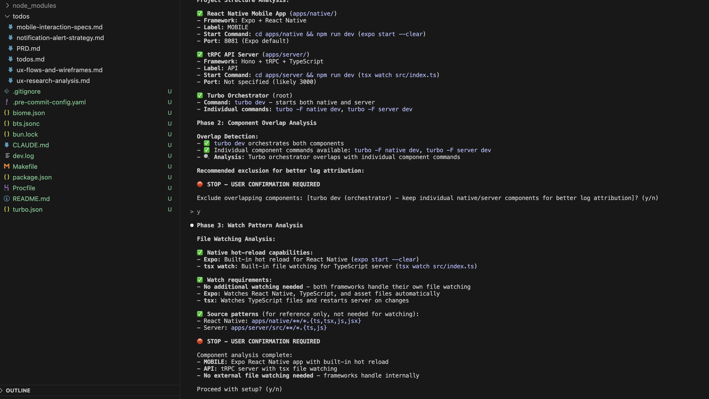
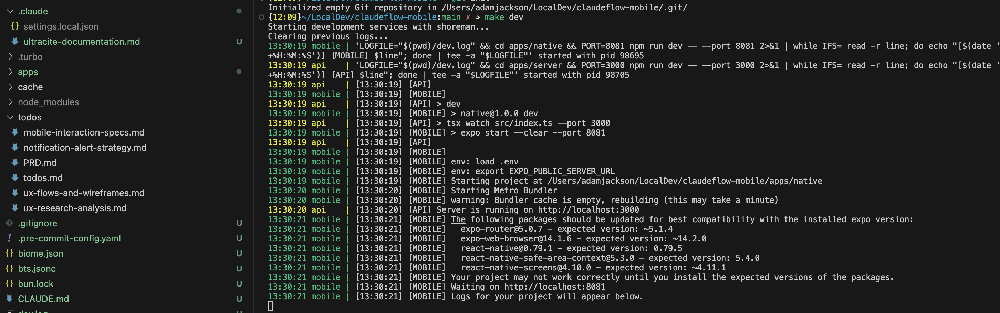
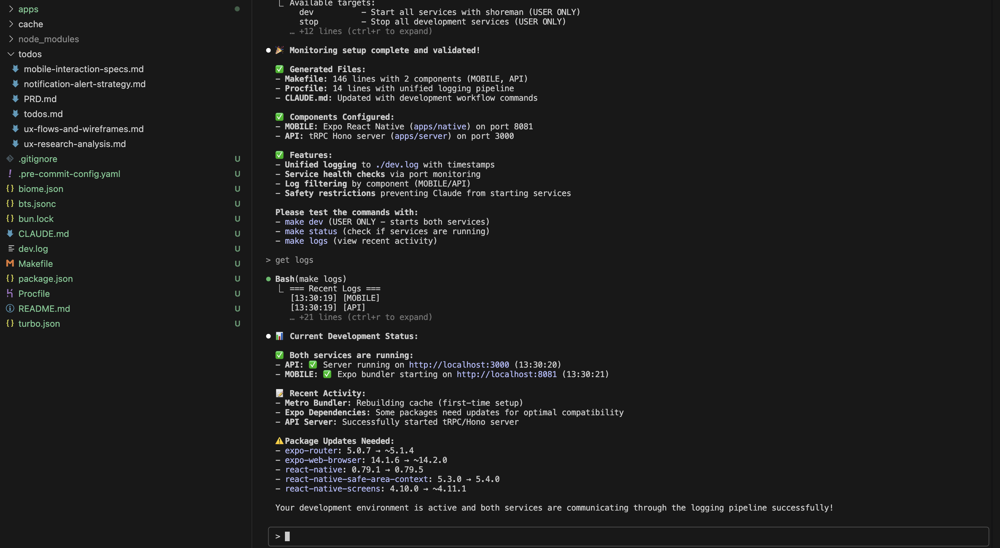

# Claude Code Workflows


> **Hybrid AI-Automation System for Claude Code**
> Specialized workflow commands + LLM actions + Python analysis scripts = multi-function, just-in-time development automation

## 📋 TL;DR

**Installation:**

```bash
./install.sh              # Install to current directory
./install.sh ~            # Install globally
./setup-dev-monitoring    # Optional: Setup unified dev logging for easier debugging
```

**Workflow Strengths:**

- **Contextual awareness** - Understands your project technologies, frameworks, and patterns
- **Hybrid approach** - Combines LLM intelligence with programmatic scripts for accuracy
- **Just-in-time** - Reduces token usage by only analyzing what's needed when needed
- **Debugging-Efficiencies** - Live monitoring dashboard shows real-time service status, unified logs, and health checks that Claude can query directly

## 🚀 Examples

### Example 1: Research and Implement a Solution

```bash
# Research and plan approaches for implementing real-time updates
/plan-solution --tdd "Add real-time updates using WebSockets"

# After choosing an approach, implement with isolated work branches
/todo-worktree
```

### Example 2: Complete End-to-End Project Setup with Live Monitoring

```bash
# Plan UX and product requirements, generating implementation todos.md
/plan-ux-prd "Mobile app for GitHub task management with real-time updates"

# Initialize project using better-t-stack.dev CLI under the hood
# Analyzes todos.md to intelligently select tech stack and setup structure
/create-project mobile-task-app --from-todos ./todos/todos.md

# Setup unified development monitoring - creates real-time dashboard
/setup-dev-monitoring
```

**What you see after `/setup-dev-monitoring`:**


_Smart stack detection: Auto-identifies React Native + Expo, tRPC + TypeScript, and sets up optimal monitoring_


_Timestamped unified logging: All services stream to `/dev.log` - Claude can query logs directly, eliminating copy/paste_


_Real-time service monitoring: Live status for API (port 3000) and Mobile (port 8081) with health indicators_

**Key Features:**

- 🚀 **Live service status**: Both API and Mobile services with health indicators
- 📊 **Real-time logs**: Unified `/dev.log` with timestamped entries from all services
- 🔍 **Smart analysis**: Auto-detects tech stack and configures optimal monitoring
- ⚡ **Hot reload monitoring**: File watching patterns and change detection
- 🛠️ **Available commands**: `make dev`, `make status`, `make logs` for instant debugging

```bash
# Add quality gates that work with the monitoring system
/add-code-precommit-checks
/add-code-posttooluse-quality-gates

# Now Claude can use monitoring data for better debugging:
# "Check the dev logs for recent API errors" → instant access to /dev.log
# "What's the current service status?" → live health check results
```

### Example 3: Security Analysis

```bash
# Get comprehensive security report following OWASP Top 10
/analyze-security

# Returns vulnerability scan, secret detection, and auth analysis
```

## 🛠️ Commands

See [detailed documentation](docs/detailed-documentation.md) for complete command reference.

**Analysis:** `/analyze-security`, `/analyze-architecture`, `/analyze-performance`, `/analyze-code-quality`
**Planning:** `/plan-solution`, `/plan-ux-prd`, `/plan-refactor`
**Project Setup:** `/create-project` - Initialize new projects with [better-t-stack.dev](https://better-t-stack.dev/new) CLI
**Implementation:** `/todo-orchestrate`, `/todo-branch`, `/todo-worktree`
**Fixes:** `/fix-bug`, `/fix-performance`, `/fix-test`
**Hooks:** `/add-code-pretooluse-rules`, `/add-code-posttooluse-quality-gates`

**Build Flags:** `--prototype` (rapid POC), `--tdd` (test-driven), `--c7` (framework best practices), `--seq` (complex breakdown)

## 🤖 Todo-Orchestrate Workflow

**Continuous build orchestration with intelligent sub-agent coordination:**

```bash
# Execute complete implementation plan with quality gates
/todo-orchestrate implementation-plan.md

# Rapid iteration with relaxed testing
/todo-orchestrate implementation-plan.md --prototype
```

**8 Specialized Sub-Agents:**

- 🔴 `@agent-cto` - Critical escalation and architecture review
- 🔵 `@agent-fullstack-developer` - Cross-platform implementation
- 🟠 `@agent-quality-monitor` - Dynamic quality gate detection
- 🟡 `@agent-solution-validator` - Pre-implementation validation
- 🟢 `@agent-plan-manager` - Task state and progress tracking
- 🟣 `@agent-log-monitor` - Runtime error detection
- ⚫ `@agent-documenter` - Documentation discovery
- ⚫ `@agent-git-manager` - Version control operations

**Key Features:**

- **Continuous execution** - Runs until all tasks complete
- **Dynamic quality gates** - Adapts to Node.js, Python, Rust, etc.
- **Smart escalation** - 3 failures → CTO → 2 attempts → human
- **Prototype mode** - `--prototype` skips tests for rapid iteration

## 📁 WIP Workflows

The `wip-workflows/` directory contains experimental workflow agents I'm testing. These aren't production-ready but shared for experimentation:

- `delivery-manager.md` - Project coordination and tracking
- `solution-architect.md` - Architecture design and tech stack selection
- `product-manager.md` - User-centered design and requirements
- `ux-designer.md` - UI/UX design and accessibility
- `mobile-developer.md` - Cross-platform mobile development
- `web-developer.md` - Web feature implementation
- `qa-analyst.md` - Comprehensive testing specialist
- `security-architect.md` - Security best practices and reviews
- `user-researcher.md` - Persona development and behavioral analysis

Feel free to explore and adapt these for your own experimentation.

## 🙏 Acknowledgments

- **Todo workflow** - Adapted from [@badlogic](https://github.com/badlogic/claude-commands/blob/main/todo.md)'s efficient Claude Commands plan mode
- **Development monitoring** - Inspired by [@mitsuhiko](https://github.com/mitsuhiko)'s development workflow approach for unified logging

## 📄 License

MIT License - See LICENSE file for details.
