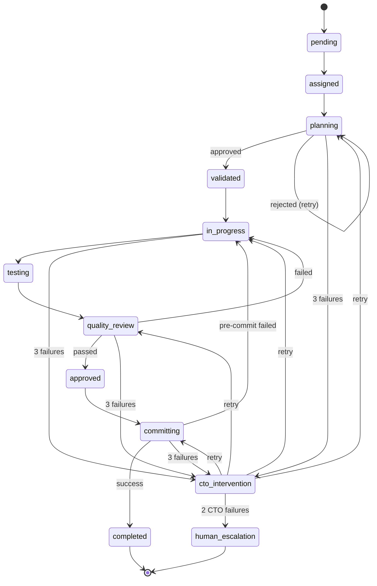

# Task State Machine

## Overview

This document formally defines the task lifecycle state machine for the build workflow system. Each task moves through defined states with specific transition rules and conditions.

## State Definitions

### pending

- **Description**: Task created but not yet assigned
- **Entry**: Task creation by user or @agent-plan-manager
- **Exit**: Assignment by build orchestrator
- **Special**: If implementing from planFile, @agent-cto performs codebase review before regular workflow
- **Timeout**: 1 hour (alert if not picked up)

### assigned

- **Description**: Task assigned to build orchestrator
- **Entry**: From pending via assignment
- **Exit**: Start of planning phase
- **Timeout**: 15 minutes (alert if not started)

### planning

- **Description**: @agent-solution-validator reviewing approach
- **Entry**: From assigned when validation begins
- **Exit**: Approval or rejection of approach
- **Timeout**: 30 minutes

### validated

- **Description**: Technical approach approved
- **Entry**: From planning via @agent-solution-validator approval
- **Exit**: Start of implementation
- **Timeout**: 15 minutes

### in_progress

- **Description**: @agent-fullstack-developer implementing
- **Entry**: From validated when coding begins
- **Exit**: Completion of implementation
- **Timeout**: 4 hours (configurable)

### testing

- **Description**: Running self-validation checks
- **Entry**: From in_progress when implementation complete
- **Exit**: Quality review request
- **Timeout**: 30 minutes

### quality_review

- **Description**: @agent-quality-monitor verification
- **Entry**: From testing when checks complete
- **Exit**: Approval or rejection
- **Timeout**: 30 minutes

### approved

- **Description**: Quality gates passed
- **Entry**: From quality_review via approval
- **Exit**: Start of commit process
- **Timeout**: 10 minutes

### committing

- **Description**: @agent-git-manager operations
- **Entry**: From approved
- **Exit**: Successful commit
- **Timeout**: 15 minutes

### completed

- **Description**: Task successfully completed
- **Entry**: From committing via successful commit
- **Exit**: Terminal state
- **Timeout**: None

### cto_intervention

- **Description**: Under @agent-cto review
- **Entry**: Any state after 3 failures
- **Exit**: Return to previous state or escalation
- **Timeout**: 1 hour

### human_escalation

- **Description**: Requires human intervention
- **Entry**: From cto_intervention after 2 @agent-cto attempts
- **Exit**: Human resolution
- **Timeout**: None (human-driven)

## State Transition Diagram



## Transition Rules

### Forward Transitions

| From State     | To State       | Condition             | Actor                      |
| -------------- | -------------- | --------------------- | -------------------------- |
| pending        | assigned       | Task picked up        | build orchestrator         |
| assigned       | planning       | Validation starts     | @agent-solution-validator  |
| planning       | validated      | Approach approved     | @agent-solution-validator  |
| validated      | in_progress    | Implementation starts | @agent-fullstack-developer |
| in_progress    | testing        | Code complete         | @agent-fullstack-developer |
| testing        | quality_review | Self-checks done      | @agent-fullstack-developer |
| quality_review | approved       | Gates passed          | @agent-quality-monitor     |
| approved       | committing     | Ready to commit       | @agent-git-manager         |
| committing     | completed      | Commit successful     | @agent-git-manager         |

### Failure Transitions

| From State       | To State         | Condition              | Actor                     |
| ---------------- | ---------------- | ---------------------- | ------------------------- |
| planning         | planning         | Approach rejected (<3) | @agent-solution-validator |
| quality_review   | in_progress      | Quality failed (<3)    | @agent-quality-monitor    |
| committing       | in_progress      | Pre-commit failed (<3) | @agent-git-manager        |
| any_state        | cto_intervention | 3 failures             | build orchestrator        |
| cto_intervention | previous_state   | CTO guidance           | @agent-cto                |
| cto_intervention | human_escalation | 2 CTO attempts         | @agent-cto                |

## State Metadata

Each task maintains metadata:

```typescript
interface TaskState {
  id: string
  title: string
  currentState: State
  previousState?: State
  assignedAgent?: string
  failureCount: number
  ctoAttempts: number
  stateHistory: StateTransition[]
  createdAt: Date
  updatedAt: Date
  timeInState: number
}

interface StateTransition {
  fromState: State
  toState: State
  timestamp: Date
  reason: string
  actor: string
}
```

## Failure Handling

### Failure Counting

- Failures counted per state, not globally
- Reset on successful state transition
- Increment on return to same state
- Track separately for CTO attempts

### Escalation Triggers

```
if (stateFailures >= 3 && ctoAttempts === 0) {
  transitionTo('cto_intervention');
} else if (ctoAttempts >= 2) {
  transitionTo('human_escalation');
}
```

### Recovery Patterns

1. **Simple Retry**: Same state, increment counter
2. **Guided Retry**: @agent-cto provides guidance
3. **Rollback**: Return to earlier state
4. **Skip**: Move to next state (@agent-cto only)
5. **Abandon**: Mark as failed (human only)

## Timing and Timeouts

### State Timeouts

- Monitored by @agent-plan-manager
- Alert build orchestrator on timeout
- Configurable per project
- Not hard stops (warnings)

### Time Tracking

```typescript
interface TimeMetrics {
  stateEnteredAt: Date
  timeInState: number // minutes
  totalTaskTime: number // minutes
  timeByState: Map<State, number>
}
```

### Timeout Actions

1. **Warning**: Log and alert at 80% timeout
2. **Alert**: Notify build orchestrator at 100%
3. **Escalate**: Consider intervention at 150%

## Validation Rules

### State Invariants

1. Task must have exactly one current state
2. Cannot skip states (except @agent-cto override)
3. Terminal states cannot transition
4. Failure count ≤ 3 per state
5. @agent-cto attempts ≤ 2 total

### Transition Validation

```typescript
function validateTransition(from: State, to: State): boolean {
  const validTransitions = {
    pending: ["assigned"],
    assigned: ["planning"],
    planning: ["validated", "planning", "cto_intervention"],
    // ... etc
  }

  return validTransitions[from]?.includes(to) || false
}
```

## Event Logging

### Required Events

1. Every state transition
2. Failure increments
3. Timeout warnings
4. Agent assignments
5. @agent-cto interventions

### Event Format

```json
{
  "timestamp": "2024-01-01T12:00:00Z",
  "taskId": "TASK-001",
  "event": "STATE_TRANSITION",
  "from": "planning",
  "to": "validated",
  "actor": "@agent-solution-validator",
  "reason": "Approach approved",
  "metadata": {}
}
```

## Query Interface

@agent-plan-manager supports queries:

```typescript
// Get all tasks in state
getTasksByState(state: State): Task[]

// Get stuck tasks
getTasksExceedingTimeout(): Task[]

// Get escalated tasks
getTasksUnderCtoReview(): Task[]

// Get failure-prone tasks
getTasksWithMultipleFailures(): Task[]

// Get task history
getTaskStateHistory(taskId: string): StateTransition[]
```

## Best Practices

1. **State Hygiene**

   - Update states immediately
   - Include transition reasons
   - Maintain accurate timestamps

2. **Failure Management**

   - Reset counters on success
   - Preserve failure context
   - Learn from patterns

3. **Timeout Handling**

   - Set realistic timeouts
   - Monitor proactively
   - Escalate appropriately

4. **@agent-cto Intervention**
   - Provide full context
   - Document guidance given
   - Track resolution patterns

Remember: The state machine ensures predictable task flow and enables effective workflow management.
