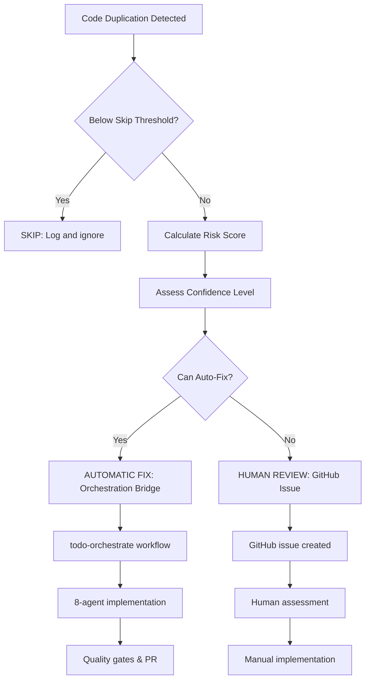

# Code Duplication Decision Matrix

**CTO-Approved Decision Logic for Continuous Improvement System**

## Overview

This document defines the decision criteria used by the continuous improvement system when code duplicates are detected. The system follows a risk-based approach to determine whether to automatically fix duplicates or require human review.

## Decision Flow



## Decision Criteria

### 1. SKIP Criteria (Don't Address)

The system skips duplications that are not worth addressing:

- **Trivial duplications**: < 5 lines of code
- **Low similarity + small size**: < 80% similarity AND < 20 lines
- **Simple variables only**: Variable duplications < 10 lines
- **Test fixtures**: Common test setup code (often intentional)

### 2. Risk Scoring (0-100 scale)

Risk factors and their weights:

| Risk Factor | Weight | Trigger Conditions |
|-------------|--------|-------------------|
| **Cross-module impact** | 3.0x | Changes span multiple modules/packages |
| **Public API** | 4.0x | Changes affect public interfaces |
| **High dependencies** | 2.5x | >5 dependencies (moderate: >2) |
| **Low test coverage** | 2.0x | <50% coverage (moderate: <80%) |
| **High complexity** | 1.5x | Cyclomatic complexity >10 (moderate: >5) |
| **Recent changes** | 1.5x | Modified <7 days ago (moderate: <30 days) |
| **Large scope** | 2.0x | >10 files affected (moderate: >5) |

### 3. Confidence Assessment

Based on similarity score and test coverage:

| Similarity | Test Coverage | Confidence |
|------------|---------------|------------|
| ≥95% | ≥80% | Very High |
| ≥95% | ≥50% | High |
| ≥85% | ≥80% | High |
| ≥85% | <80% | Medium |
| <85% | Any | Low |

### 4. Automatic Fix Criteria

**Never Auto-Fix:**
- Public API changes
- Cross-module impacts without very high confidence

**Auto-Fix Scenarios:**

#### Scenario 1: Simple Internal Functions
- Similarity ≥90%
- Functions only
- Same module
- ≤3 files
- ≥70% test coverage

#### Scenario 2: Private Methods
- Similarity ≥85%
- Methods only
- Same module
- Not public API
- ≤3 dependencies

#### Scenario 3: Variables/Constants
- Similarity ≥95%
- Variables only
- ≤50 lines
- Complexity ≤3

#### Scenario 4: Well-Tested Code
- Test coverage ≥90%
- Similarity ≥88%
- ≤5 dependencies
- Risk score ≤20

### 5. Risk Thresholds by Confidence

| Confidence | Max Risk Score |
|------------|----------------|
| Very High | 40 |
| High | 25 |
| Medium | 15 |
| Low | 0 (never auto-fix) |

## Implementation Workflows

### Automatic Fix Path

1. **OrchestrationPlan Created**
   - Title, description, acceptance criteria
   - Recommended approach (extract_to_shared_utility, create_common_module, etc.)
   - Quality gates and testing strategy

2. **Orchestration Bridge Triggered**
   - Full implementation plan passed
   - todo-orchestrate workflow initiated

3. **8-Agent Workflow**
   - build-orchestrator coordinates
   - fullstack-developer implements
   - quality-monitor enforces gates
   - git-manager handles commits
   - CTO escalation if failures

### Human Review Path

1. **GitHub Issue Created**
   - Risk assessment and concerns
   - Implementation recommendations
   - Priority and labels assigned

2. **Human Assessment**
   - Architectural impact review
   - Refactoring approach decision
   - Implementation planning

## Quality Gates

### Always Applied
- All tests pass
- Code coverage maintained
- Linting passes
- No new security vulnerabilities

### Context-Specific
- **Public API**: API compatibility verified
- **Cross-module**: Integration tests pass, boundaries respected
- **Low coverage**: Test coverage improved for refactored code

## Example Decisions

### Auto-Fix Example
```
Context: 92% similar function in 2 files, 25 lines, 85% test coverage
Risk Score: 12 (low risk)
Confidence: High
Decision: AUTOMATIC FIX
Approach: extract_to_shared_utility
```

### Human Review Example
```
Context: 88% similar class across 8 files, cross-module, public API
Risk Score: 75 (high risk)
Confidence: Medium
Decision: HUMAN REVIEW
Concerns: Breaking API changes, architectural boundaries
```

### Skip Example
```
Context: 78% similar variable, 4 lines
Decision: SKIP
Rationale: Below actionable threshold
```

## Integration Points

- **Serena MCP**: Code similarity detection and analysis
- **orchestration_bridge**: Automatic fix implementation planning
- **todo-orchestrate**: Full 8-agent workflow execution
- **GitHub API**: Issue creation for human review
- **Quality Monitor**: Dynamic quality gate detection and enforcement

## Monitoring and Metrics

The system tracks:
- Decision distribution (auto-fix vs human review vs skip)
- Success rates of automatic fixes
- Time to resolution for human reviews
- Risk score accuracy over time
- Quality gate effectiveness

This decision matrix balances automation efficiency with risk management, ensuring that simple duplications are quickly resolved while complex scenarios receive appropriate human oversight.
